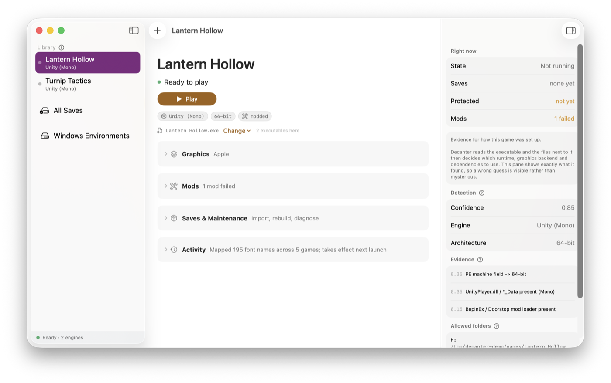
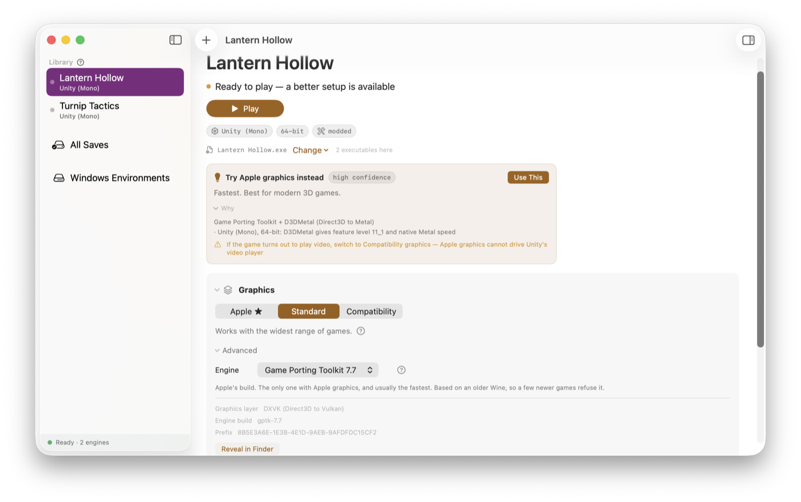
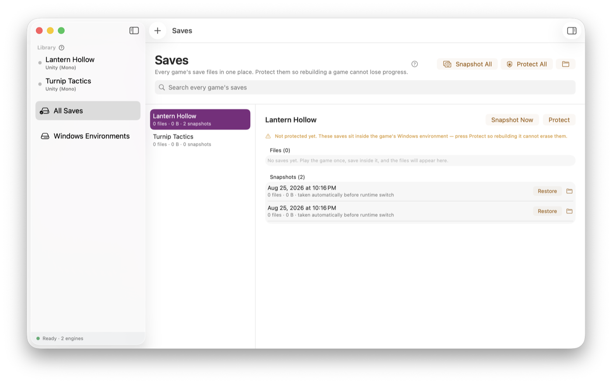

# Decanter

**Run Windows games on your Apple Silicon Mac.**

[](LICENSE)
[](https://github.com/ricardothesillyllama/Decanter/releases)
[](#requirements)

Decanter manages Wine for you: it works out what a game needs, builds it an
isolated Windows environment, and picks the graphics translation most likely to
work — instead of leaving you to guess between five combinations and try each
one by hand.

It is a maintained alternative to [Whisky](https://github.com/Whisky-App/Whisky),
which was archived in 2025. When Whisky's bundled Wine repository was deleted,
installed copies could no longer finish setting themselves up. Decanter is built
so that cannot happen to it: it downloads nothing, and keeps its own copy of
every runtime it uses.



## What you get

- **A native Mac app and a full CLI**, sharing one engine. Either is enough on
  its own.
- **A recommendation, not a guessing game.** Decanter reads the game's engine,
  architecture and graphics API, combines that with what has already worked on
  your machine, and tells you which runtime and backend to use — and why.
- **Every game isolated.** Each one gets its own Windows environment, cloned
  instantly with APFS copy-on-write. No game can break another.
- **Your saves kept safe.** Saves are stored outside the Windows environment and
  linked back in, so rebuilding a broken game never destroys your progress.
  Snapshots on demand.
- **Games cannot read your files.** Unlike Whisky, no game gets a view of your
  whole Mac — just its own folder.
- **Real answers when something breaks.** One command produces a problem report
  with the runtime actually in use, the graphics layer actually loaded, an
  automatic diagnosis, and the relevant log lines.
- **Mod support.** BepInEx is detected and wired up automatically, with plugin
  status and loader errors surfaced in the app.

### Pick a graphics mode without guessing

Decanter recommends one and says why. The real names — DXVK, D3DMetal, WineD3D —
are a click away under Advanced, for when a forum thread uses them.



### Saves that survive a rebuild

Protected saves are stored outside the game's Windows environment and linked
back in, so starting a game over cannot lose progress.



## Quick start

Download the [latest release](https://github.com/ricardothesillyllama/Decanter/releases/latest),
drag Decanter into Applications, and drop a game folder onto it.

Or from source, if you prefer the CLI:

```sh
git clone https://github.com/ricardothesillyllama/Decanter.git
cd Decanter && ./install.sh
decanter pin && decanter template build     # one-time setup
decanter add ~/Games/SomeGame
decanter run SomeGame
```

You will need a Wine build and, ideally, Apple's Game Porting Toolkit — see
[Getting the pieces](#getting-the-pieces). Decanter does not download them for
you, on purpose.

> The screenshots above are Decanter running against a throwaway demo library.
> `./scripts/make-demo.sh` builds it, if you want the same starting point.

## How this compares

There are several ways to run Windows games on a Mac, and Decanter is not the
right answer to all of them. It is worth being plain about that.

| | What it is | Status |
|---|---|---|
| **[CrossOver](https://www.codeweavers.com/crossover)** | Commercial, paid, with support staff and by far the broadest compatibility | Actively developed |
| **[Sikarugir](https://github.com/Sikarugir-App/Sikarugir)** | Successor to Wineskin. Wraps a Windows program into a self-contained `.app`, with five renderers including DXMT and VKD3D | Actively developed, ~3.5k stars |
| **[Whisky](https://github.com/Whisky-App/Whisky)** | The bottle manager most people used | **Archived 2025.** Its runtime repository was deleted, so installed copies could not finish setting up |
| **[Bourbon](https://github.com/leonewt0n/Bourbon)** | A fork of Whisky | **Archived December 2025**, points users to Sikarugir |
| **Decanter** | A library manager: add a game, it decides how to run it | New, and tested by one person so far |

**If you want the most compatible option, buy CrossOver.** It is better funded
than any of this and it is not close.

**If you want to hand someone a single `.app` that runs a Windows program**,
Sikarugir is built for exactly that and Decanter is not. It also supports DXMT
and VKD3D, which Decanter does not, and runs on Intel Macs, which Decanter does
not.

### What Decanter does differently

**It never downloads a runtime.** You supply Wine and the Game Porting Toolkit;
Decanter takes its own copy into its own store. This is the whole reason the
project exists — two of the four projects above are archived, and Whisky's
installed copies broke because something upstream disappeared. Nothing upstream
can reach into a Decanter install.

**It decides for you, and says why.** Five runtime and renderer combinations
exist and picking between them by hand is miserable. Decanter reads the game's
engine, architecture and graphics API, combines that with what has already
worked on your machine for games of the same shape, and applies the answer.
Two of its rules were measured rather than guessed — a game that plays video
cannot use D3DMetal, and 32-bit games belong on current Wine rather than the
Game Porting Toolkit's 2022 base.

**Games cannot see your files.** Whisky mapped your entire filesystem into every
bottle, so any Windows binary could read `~/Documents`, `~/.ssh` and iCloud.
Decanter grants a game its own folder and a shared games directory, closes the
seventeen further routes Wine opens through its mapped user folders, and
verifies it before every launch.

**Saves survive a rebuild.** Broken environments are replaced rather than
repaired, because repair heuristics rot. That is only safe because saves are
moved out of the environment first and linked back in.

**It is much younger than the alternatives**, has been used in anger by one
person, and is not notarised. If you need something proven today, use one of
the others — and if Decanter is ever archived, the design at least means your
installed games keep working.

## Questions

**Will my game work?**
Often, but nobody can promise it. Decanter is a manager for Wine, and Wine's
compatibility is what it is. Small and mid-sized games usually work; anything
with kernel-level anti-cheat does not, and never will. Unity 6 games do not
work yet on any Mac. The fastest way to find out is to add the game and press
Play — it costs a few seconds and nothing is modified outside Decanter.

**Do I need a Windows licence?**
No. Wine is not Windows and does not contain any of it; it re-implements the
interfaces Windows programs expect. You need the game, nothing else.

**Why do I have to download Wine and the Game Porting Toolkit myself?**
Because Whisky died exactly that way. It fetched its Wine at setup time, the
upstream repository was deleted, and every installed copy became unable to
finish setting itself up. Decanter never downloads a runtime, so nothing
upstream can break your installed games. It is more work once, and then it
cannot happen to you.

**How is this different from CrossOver, Sikarugir or Whisky?**
See [How this compares](#how-this-compares) above — including where those are
the better choice.

**Can games see the rest of my Mac?**
No. Each game gets its own private Windows environment containing its own
folder and a shared games directory, and nothing else — not your Documents, not
your keys, not iCloud. This is checked before every launch. Whisky mapped your
whole filesystem into every game.

**Does it phone home?**
No. Decanter makes no network requests at all. The single exception is
**Windows Components**, which runs winetricks to fetch a Visual C++ runtime or
codec from its publisher — and only when you press it.

**How much disk does it use?**
Very little. Each game's Windows environment is copy-on-write cloned from one
template, measured at 335 MB in 0.46 seconds and costing almost no real disk.
Your actual game files stay wherever you downloaded them and are never copied.

**macOS says the app is not verified. Is it broken?**
No — it is unsigned by Apple, which needs a paid developer account this project
does not have. Open **System Settings ▸ Privacy & Security**, scroll to the
bottom, press **Open Anyway**. Once only. Building from source avoids it
entirely.

**Do I need to know what DXVK is?**
No. Decanter picks for you and shows the choice as Apple, Standard or
Compatibility. The real names are under Advanced for when a forum thread uses
them.

**Will I lose my saves?**
Not if you press **Protect** on the Saves page. That moves them out of the
game's Windows environment and links them back in, so rebuilding a broken game
cannot touch them. Decanter also snapshots automatically before anything
destructive.

**It does not work and I do not know why.**
Press **Report a Problem** on the game page. It copies a full diagnostic and
opens a prefilled issue. You may rename or redact the game — the report is
still useful without the title.

## Requirements

- Apple Silicon Mac, macOS 14 or later
- **Xcode Command Line Tools** — `xcode-select --install`. Full Xcode is not needed.
- **Rosetta 2** — `softwareupdate --install-rosetta`. Wine's 32-bit support needs it.
- At least one Wine build, and ideally two (see below)

Decanter downloads nothing and bundles nothing. It never contacts the network at
all. You supply the runtimes; Decanter takes its own copy of each and manages
them. That is deliberate — Whisky died because the runtime it fetched at setup
time was deleted upstream, and installed copies could no longer finish setting
themselves up.

## Getting the pieces

**Game Porting Toolkit (GPTK)** gives you D3DMetal, Apple's Direct3D-to-Metal
translation, which is the fastest option for modern 3D games. Apple distributes
it from the [developer downloads](https://developer.apple.com/download/all/)
page (search "Game Porting Toolkit"; a free Apple ID is enough). It ships as a
disk image containing a Wine tree — point Decanter at it:

    decanter runtime add /path/to/Game\ Porting\ Toolkit/wine

**A mainline Wine build** covers everything GPTK cannot. GPTK is based on
Wine 7.7 from 2022, so newer titles often need something current. Any Apple
Silicon Wine build works — for example the casks published by
[Gcenx](https://github.com/Gcenx/homebrew-wine). Once installed anywhere on the
system:

    decanter pin        # finds every Wine build present and copies each into Decanter's store

**DXVK** translates Direct3D to Vulkan and is what most games want. Download a
release tarball from [doitsujin/dxvk](https://github.com/doitsujin/dxvk/releases)
and stage it:

    decanter dxvk stage ~/Downloads/dxvk-1.10.3.tar.gz

> **Get 1.10.3, not the newest.** DXVK 2.x and 3.x require Vulkan 1.3 features
> MoltenVK does not fully implement, so they fail on macOS in ways that look
> like game bugs. 1.10.3 targets Vulkan 1.1 and is the one that works here. You
> can stage several versions and switch per game with `decanter dxvk use`.

Neither runtime is redistributed by this project, and none of them are its work:
Wine is LGPL, DXVK is zlib-licensed, and GPTK is Apple's, under Apple's terms.

## Install

**Download the [latest release](https://github.com/ricardothesillyllama/Decanter/releases/latest)**, open the disk image, and drag Decanter into Applications.

macOS will refuse to open it the first time, because releases are not notarised
— that needs a paid Apple Developer account this project does not have. Open
**System Settings ▸ Privacy & Security**, scroll to the bottom, and press **Open
Anyway**. Once only.

### Or build it yourself

Nothing downloaded, nothing to allow — a locally built app is never quarantined:

```sh
./install.sh
```

That builds in release mode, assembles `Decanter.app` into `/Applications`, and
puts the `decanter` CLI on your `PATH`. It is the recommended path if you have
the Command Line Tools already.

## Setup

    decanter pin                       # take our own copy of every Wine build found
    decanter runtime add <wine-root>   # pin a GPTK build from anywhere
    decanter dxvk stage dxvk-1.10.3.tar.gz
    decanter template build            # golden template, with DXVK baked in

## Use

    decanter add ~/Games/SomeGame      # folder or .exe; auto-detects
    decanter recommend SomeGame        # what should this game run on, and why
    decanter check SomeGame            # dry-run: would it launch?
    decanter run SomeGame
    decanter exes SomeGame             # list every .exe; pick a different one
    decanter diagnose SomeGame         # classify the last failure
    decanter import SomeGame ./saves   # restore saves + merge registry
    decanter rederive SomeGame

Run `decanter help` for the full list.

## Troubleshooting

Start here. Most problems are one of these, and the first row fixes a
surprising share of them.

| What you see | Usually means | Do this |
|---|---|---|
| Window flashes and closes, or nothing happens | Wrong runtime or graphics backend | `decanter recommend <game> --apply`, then run it again |
| Text is missing — buttons and menus are blank but correctly sized | The game asks for a Windows-only font that macOS does not have | `decanter fonts` |
| Game runs, but cutscenes or videos fail | D3DMetal has no `ID3D11Multithread`, so video cannot play on it | Switch the backend to **WineD3D** |
| Black screen, or garbled 3D | Backend mismatch | Try **DXVK 1.10.3** first, then **WineD3D** |
| Crash naming a plugin, or a mod loader error | A BepInEx plugin threw | Check **Mods** in the app, or `decanter mods <game>` |
| `Failed to load il2cpp` | Usually Unity 6, which does not work on any current runtime | `decanter info <game>` will say if it is Unity 6 |
| `Failed to open descriptor file '../../X.uproject'` | The wrong executable is being launched | Pick the launcher beside `Engine/` in the executable picker |
| Fans spin up and macOS blames Decanter while it is closed | Wine processes left running by an earlier session | `decanter reap` |
| The app forgets granted permissions after every rebuild | Ad-hoc signing — see [Signing](docs/TROUBLESHOOTING.md#signing-and-why-permissions-reset) | Create a `Decanter Dev` certificate once |
| Worked before, broken after a game update or new mods | Detection is stale | `decanter redetect <game>`, then `decanter rederive <game>` if needed |

**[Full troubleshooting guide →](docs/TROUBLESHOOTING.md)** — choosing a
graphics mode, blank text, missing Windows files, leftover processes, signing.

Two things worth knowing before you go deeper:

- **You do not need a Microsoft C++ runtime.** Wine ships `vcruntime140` and
  `msvcp140` as builtins. A game complaining about them under Wine usually has a
  different problem.
- **Newer DXVK is not better here.** 2.x and 3.x need Vulkan 1.3 features
  MoltenVK does not fully implement. 1.10.3 is the one that works on macOS.

## Reporting a problem

```sh
decanter report <game>     # lands on your clipboard
```

**Report a Problem** on the game page does both steps for you: it copies the
report and opens a prefilled issue. Or run the command above and open the issue
yourself with the **A game does not work** template. The
report contains the machine, the runtime and backend *actually* in use (not
merely the one configured), the DXVK build actually installed in the prefix,
whether font names are mapped, detection evidence, an automatic diagnosis, and
the graphics-related log lines.

**You can rename or redact the game.** The report is still useful without the
title. Decanter itself never records game names outside your own library — the
knowledge base counts confirmations, it does not name them.

If the fault is visual, add a screenshot: Command-Shift-4, then Space, then
click the window. Decanter never captures the screen, so it never asks for
Screen Recording permission.

## Known limitations

- **Unity 6 (6000.x) does not work** on any runtime or backend currently
  available. Decanter detects it and says so rather than letting you guess.
- **DXMT** (Direct3D 11 straight to Metal) needs a Wine that exposes hidden
  `winemac.drv` symbols. No FOSS build currently does.
- Nothing is notarised; see above.

## Status

Verified working on an M2 MacBook Air, macOS 26.5.1, with Wine 11.0 and
GPTK 3.0-3 pinned side by side.

## How it works

Runtimes are pinned, every game gets its own copy-on-write environment, broken
environments are replaced rather than repaired, and no game can see your files.
The reasoning behind each of those is in **[docs/DESIGN.md](docs/DESIGN.md)**.

Decanter is a `decanter` CLI and a SwiftUI app over one engine, written in
Swift with no external dependencies — every dependency is a future 404.
**328 checks** run in a hand-rolled harness; see
[CONTRIBUTING.md](CONTRIBUTING.md).

## Contributing

Bug reports for games that do not work are the most useful contribution, and
they need no code — see [CONTRIBUTING.md](CONTRIBUTING.md). It also lists the
handful of rules this codebase actually holds to, each of which exists because
breaking it caused a real failure.

## License

GPL-3.0. See [LICENSE](LICENSE).

Decanter bundles no third-party code. Wine, DXVK and the Game Porting Toolkit
are separate works under their own licenses and are neither included nor
redistributed here.
