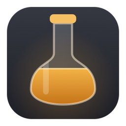
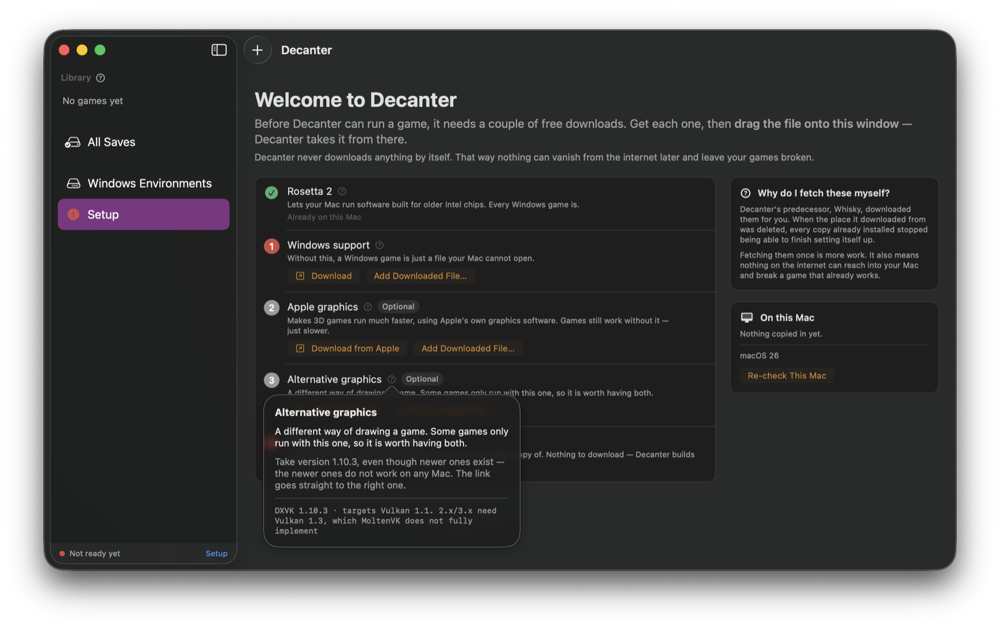
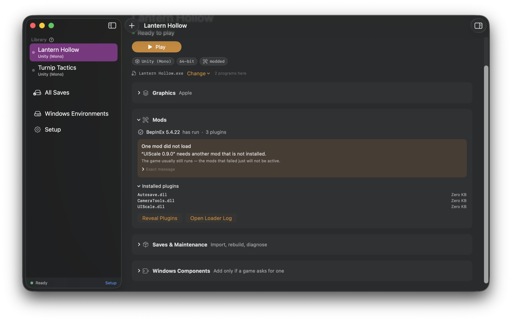

<div align="center">



# Decanter

**Run Windows games on your Apple Silicon Mac.**

Add a game. Decanter works out what it needs, builds it an isolated Windows
environment, and picks the graphics translation most likely to work —
instead of leaving you to guess between five combinations and try each by hand.

[](https://github.com/ricardothesillyllama/Decanter/releases/latest)
[](https://github.com/ricardothesillyllama/Decanter/actions/workflows/ci.yml)
[](#install)
[](LICENSE)

</div>


Decanter is a maintained alternative to [Whisky](https://github.com/Whisky-App/Whisky),
which was archived in 2025. When Whisky's bundled Wine repository was deleted,
installed copies could no longer finish setting themselves up. **Decanter is
built so that cannot happen to it: it downloads nothing, and keeps its own copy
of every runtime it uses.**

## Install

1. **[Download the latest release](https://github.com/ricardothesillyllama/Decanter/releases/latest)**
   and drag Decanter into Applications.
2. Open it. **Setup** lists what it needs, what it already found on your Mac,
   and where each missing piece comes from.
3. Fetch those — they are free — **drop them on the window**, and press Play.

No Terminal at any point.



Decanter tells you what it needs in words that assume nothing, and links to
where each piece comes from. The question mark beside each row carries the
exact project and version, for when you already know what these are.

> [!NOTE]
> macOS will refuse to open it the first time, because releases are not
> notarised — that needs a paid Apple Developer account this project does not
> have. **System Settings ▸ Privacy & Security ▸ Open Anyway**, once only.
> A locally built app is never quarantined, so `./install.sh` avoids this
> entirely.

**Requires** macOS 14 or later on Apple Silicon, and Rosetta 2 (Setup installs
it for you). You also supply a Wine build, and ideally Apple's Game Porting
Toolkit — see **[Getting the runtimes](docs/RUNTIMES.md)** for what each one
buys you and where to get it.

<details>
<summary>Or from the CLI, if you prefer</summary>

```sh
git clone https://github.com/ricardothesillyllama/Decanter.git
cd Decanter && ./install.sh
decanter setup                              # what is missing, and where it comes from
decanter use ~/Downloads/dxvk-1.10.3.tar.gz # same for a Wine folder or a .dmg
decanter add ~/Games/SomeGame
decanter run SomeGame
```

The CLI and the app are one engine with two faces; either is enough on its own.
**[Full command reference →](docs/CLI.md)**
</details>

## What you get

- **A recommendation, not a guessing game.** Decanter reads the game's engine,
  architecture and graphics API, combines that with what has already worked on
  your machine for games of the same shape, and tells you which runtime and
  graphics layer to use — and why.
- **Every game isolated.** Each gets its own Windows environment, cloned
  instantly with APFS copy-on-write. No game can break another.
- **Games cannot read your files.** Unlike Whisky, no game gets a view of your
  whole Mac — just its own folder.
- **Your saves kept safe.** Saves are stored outside the Windows environment and
  linked back in, so rebuilding a broken game never destroys your progress.
  Snapshots on demand.
- **Real answers when something breaks.** One button produces a problem report
  with the runtime actually in use, the graphics layer actually loaded, an
  automatic diagnosis, and the relevant log lines.
- **Mod support.** BepInEx is detected and wired up automatically, with plugin
  status and loader errors surfaced in the app.
- **Setup that never phones home.** Decanter makes no network requests at all —
  a rule the build enforces, not just documents.

### Pick a graphics mode without guessing

Options are named for what they are, never for how well they work — compatibility
is per-game, not a ranking. Decanter's pick is a badge beside the name, and the
real names (D3DMetal, DXVK, WineD3D) sit right there for when a forum thread
uses them.


When a graphics option is missing from the list, the app says which one and
why — measured from the Wine build itself, not assumed.

### Check before you launch

**Test Launch** does everything starting the game does except start it: resolves
the path, applies the drive scopes, and asks Wine itself whether it can see the
program. The failure this is for is the quiet one — a graphics option the Wine
build cannot actually provide, where Wine's own graphics load instead and the
game dies with nothing in the log to find.

### Saves that survive a rebuild

Protected saves live outside the game's Windows environment and are linked back
in, so starting a game over cannot lose progress. Decanter also snapshots by
itself before anything destructive.


### Mod failures in plain language

BepInEx is detected and wired up automatically. When a plugin fails, the app
says which one and why, with the exact log line underneath.



### A way back, and a question worth asking

A game remembers the setup it last worked on, with a date, and offers to go back
to it. Saves are kept.

And when a launch is ambiguous — a window that appeared and then vanished, a
process with no window at all — Decanter says what it saw and asks you once
whether it played. A launch that plainly worked is recorded without asking:
being made to confirm the obvious is how a prompt becomes something you dismiss
without reading.

## How this compares

There are several ways to run Windows games on a Mac, and Decanter is not the
right answer to all of them. It is worth being plain about that.

| | What it is | Status |
|---|---|---|
| **[CrossOver](https://www.codeweavers.com/crossover)** | Commercial, paid, with support staff and by far the broadest compatibility | Actively developed |
| **[Sikarugir](https://github.com/Sikarugir-App/Sikarugir)** | Successor to Wineskin. Wraps a Windows program into a self-contained `.app`, with five renderers including DXMT and VKD3D | Actively developed, ~3.5k stars |
| **[Whisky](https://github.com/Whisky-App/Whisky)** | The bottle manager most people used | **Archived 2025.** Its runtime repository was deleted, so installed copies could not finish setting up |
| **[Bourbon](https://github.com/leonewt0n/Bourbon)** | A fork of Whisky | **Archived December 2025**, points users to Sikarugir |
| **Decanter** | A library manager: add a game, it decides how to run it | New, and tested by one person so far |

**If you want the most compatible option, buy CrossOver.** It is better funded
than any of this and it is not close.

**If you want to hand someone a single `.app` that runs a Windows program**,
Sikarugir is built for exactly that and Decanter is not. It also supports DXMT
and VKD3D, which Decanter does not, and runs on Intel Macs, which Decanter does
not.

### What Decanter does differently

**It never downloads a runtime.** You supply Wine and the Game Porting Toolkit;
Decanter takes its own copy into its own store. This is the whole reason the
project exists — two of the four projects above are archived, and Whisky's
installed copies broke because something upstream disappeared. Nothing upstream
can reach into a Decanter install.

**It decides for you, and says why.** Five runtime and renderer combinations
exist and picking between them by hand is miserable. Decanter reads the game's
engine, architecture and graphics API, combines that with what has already
worked on your machine for games of the same shape, and applies the answer.
Two of its rules were measured rather than guessed — a game that plays video
cannot use D3DMetal, and 32-bit games belong on current Wine rather than the
Game Porting Toolkit's 2022 base.

**Games cannot see your files.** Whisky mapped your entire filesystem into every
bottle, so any Windows binary could read `~/Documents`, `~/.ssh` and iCloud.
Decanter grants a game its own folder and a shared games directory, closes the
seventeen further routes Wine opens through its mapped user folders, and
verifies it before every launch.

**Saves survive a rebuild.** A broken Windows environment is replaced rather
than repaired, because repair heuristics rot and an environment is rebuilt in
half a second anyway. That is only safe because saves are moved out of it first
and linked back in.

**A Wine build is a different matter, and Decanter checks it.** A missing
library there is silent: the game renders blank boxes or plays no video, and
nothing writes an error anywhere. `decanter audit` finds what a build references
but does not carry, and `decanter repair` offers to fill the gaps from builds
already on your Mac. Nothing is downloaded, and it can be undone.

**It is much younger than the alternatives**, has been used in anger by one
person, and is not notarised. If you need something proven today, use one of
the others — and if Decanter is ever archived, the design at least means your
installed games keep working.

## Questions

<details>
<summary><b>Will my game work?</b></summary>

Often, but nobody can promise it. Decanter is a manager for Wine, and Wine's
compatibility is what it is. Small and mid-sized games usually work; anything
with kernel-level anti-cheat does not, and never will. Unity 6 games need
Metal graphics (DXMT) and a Wine build that can host it — see
[Known limitations](#known-limitations). The fastest way to find out is to add
the game and press Play — it costs a few seconds and nothing is modified outside Decanter.

</details>

<details>
<summary><b>Do I need a Windows licence?</b></summary>

No. Wine is not Windows and does not contain any of it; it re-implements the
interfaces Windows programs expect. You need the game, nothing else.

</details>

<details>
<summary><b>Why do I have to download Wine and the Game Porting Toolkit myself?</b></summary>

Because Whisky died exactly that way. It fetched its Wine at setup time, the
upstream repository was deleted, and every installed copy became unable to
finish setting itself up. Decanter never downloads a runtime, so nothing
upstream can break your installed games. It is more work once, and then it
cannot happen to you.

</details>

<details>
<summary><b>How is this different from CrossOver, Sikarugir or Whisky?</b></summary>

See [How this compares](#how-this-compares) above — including where those are
the better choice.

</details>

<details>
<summary><b>Can games see the rest of my Mac?</b></summary>

No. Each game gets its own private Windows environment containing its own
folder and a shared games directory, and nothing else — not your Documents, not
your keys, not iCloud. This is checked before every launch. Whisky mapped your
whole filesystem into every game.

</details>

<details>
<summary><b>Does it phone home?</b></summary>

No. Decanter makes no network requests at all. The single exception is
**Windows Components**, which runs winetricks to fetch a Visual C++ runtime or
codec from its publisher — and only when you press it.

</details>

<details>
<summary><b>How much disk does it use?</b></summary>

Very little. Each game's Windows environment is copy-on-write cloned from one
template, measured at 335 MB in 0.46 seconds and costing almost no real disk.
Your actual game files stay wherever you downloaded them and are never copied.

</details>

<details>
<summary><b>macOS says the app is not verified. Is it broken?</b></summary>

No — it is unsigned by Apple, which needs a paid developer account this project
does not have. Open **System Settings ▸ Privacy & Security**, scroll to the
bottom, press **Open Anyway**. Once only. Building from source avoids it
entirely.

</details>

<details>
<summary><b>Do I need to know what DXVK is?</b></summary>

No. Decanter picks for you, and the options are named Apple, Vulkan and Wine —
what each one *is*, not how good it is. The real names sit beside them for when
a forum thread uses them.

</details>

<details>
<summary><b>Will I lose my saves?</b></summary>

Not if you press **Protect** on the Saves page. That moves them out of the
game's Windows environment and links them back in, so rebuilding a broken game
cannot touch them. Decanter also snapshots automatically before anything
destructive.

</details>

<details>
<summary><b>It does not work and I do not know why.</b></summary>

Press **Report a Problem** on the game page. It copies a full diagnostic and
opens a prefilled issue. You may rename or redact the game — the report is
still useful without the title.

</details>

## Troubleshooting

Start here. Most problems are one of these, and the first row fixes a
surprising share of them.

| What you see | Usually means | Do this |
|---|---|---|
| Window flashes and closes, or nothing happens | Wrong runtime or graphics backend | `decanter recommend <game> --apply`, then run it again |
| Text is missing — buttons and menus are blank but correctly sized | The game asks for a Windows-only font that macOS does not have | `decanter fonts` |
| Game runs, but cutscenes or videos fail | D3DMetal has no `ID3D11Multithread`, so video cannot play on it | Switch graphics to **Wine** (WineD3D) |
| Black screen, or garbled 3D | Wrong graphics option for this game | Try **Vulkan** (DXVK 1.10.3) first, then **Wine** (WineD3D) |
| Crash naming a plugin, or a mod loader error | A BepInEx plugin threw | Check **Mods** in the app, or `decanter mods <game>` |
| `Failed to load il2cpp` | Usually Unity 6, which only Metal graphics (DXMT) runs | `decanter knowledge explain <game>` shows how far each one gets |
| `Failed to open descriptor file '../../X.uproject'` | The wrong executable is being launched | Pick the launcher beside `Engine/` in the executable picker |
| Fans spin up and macOS blames Decanter while it is closed | Wine processes left running by an earlier session | `decanter reap` |
| The app forgets granted permissions after every rebuild | Ad-hoc signing — see [Signing](docs/TROUBLESHOOTING.md#signing-and-why-permissions-reset) | Create a `Decanter Dev` certificate once |
| Worked before, broken after a game update or new mods | Detection is stale | `decanter redetect <game>`, then `decanter rederive <game>` if needed |
| Worked before and nothing obvious changed | The setup moved off what was working | `decanter restore <game>` says what it last ran on; `--do` puts it back |
| Text never draws, or video never plays, and no setting helps | The Wine build is missing a library it needs — a silent failure, not a game problem | `decanter audit`, then `decanter repair <runtime>` |

**[Full troubleshooting guide →](docs/TROUBLESHOOTING.md)** — choosing a
graphics mode, blank text, incomplete Wine builds, missing Windows files,
leftover processes, signing.

Two things worth knowing before you go deeper:

- **You do not need a Microsoft C++ runtime.** Wine ships `vcruntime140` and
  `msvcp140` as builtins. A game complaining about them under Wine usually has a
  different problem.
- **Newer DXVK is not better here.** 2.x and 3.x need Vulkan 1.3 features
  MoltenVK does not fully implement. 1.10.3 is the one that works on macOS.

## Reporting a problem

```sh
decanter report <game>     # lands on your clipboard
```

**Report a Problem** on the game page does both steps for you: it copies the
report and opens a prefilled issue. Or run the command above and open the issue
yourself with the **A game does not work** template. The
report contains the machine, the runtime and backend *actually* in use (not
merely the one configured), the DXVK build actually installed in the prefix,
whether font names are mapped, detection evidence, an automatic diagnosis, and
the graphics-related log lines.

**You can rename or redact the game.** The report is still useful without the
title. Decanter itself never records game names outside your own library — the
knowledge base counts confirmations, it does not name them.

If the fault is visual, add a screenshot: Command-Shift-4, then Space, then
click the window. Decanter never captures the screen, so it never asks for
Screen Recording permission.

## Known limitations

- **Unity 6 (6000.x) runs, on Metal graphics (DXMT) and nothing else.** Measured
  on an M2 against a real 6000.2 build: DXVK on MoltenVK fails D3D11 device
  creation at *every* feature level, down to 10_0; WineD3D cannot create a device
  either; D3DMetal has no `ID3D11Fence`, no `ID3D11Multithread` and no
  `D3D11On12`, and Unity stops at `InitializeEngineGraphics failed`. DXMT runs
  it — `Direct3D 11.0 [level 11_1]`, `Renderer: Apple M2`, gameplay on screen.
  Unity still logs `GpuFence::Create(): Failed to create ID3D11Fence` and carries
  on regardless; that line looked like the blocker for a long time and never was.
- **DXMT needs a Wine whose Mac driver is a dylib *and* exports
  `macdrv_functions`.** Both, not either — which is why this file has now been
  wrong about it twice. DXMT's Metal bridge hard-links `@rpath/winemac.so`, so a
  Mach-O *bundle* is refused by macOS outright: that rules out the Game Porting
  Toolkit, whose driver is a bundle. But linking is only the first gate. DXMT
  then asks the driver for something to draw into, with `dlsym`, at the first
  frame — so a build that links and exports nothing loads perfectly, reaches a
  Direct3D 11 device, and dies with "your Wine has no exported symbols needed by
  DXMT". Mainline Wine 11 is exactly that build, and 0.4.x offered DXMT on it.
  Gcenx's **Sikarugir build of Wine 10** is a dylib that exports
  `macdrv_functions`, and Unity 6 runs on it. `decanter doctor` reports which of
  the two gates each pinned runtime fails.
- Nothing is notarised — see [Install](#install) for the one-time "Open Anyway".

## Status

Tested by one person, on an M2 MacBook Air running macOS 26.5, with Wine 11.0
and Apple's Game Porting Toolkit pinned side by side.

Runtimes are pinned and measured rather than trusted, every game gets its own
copy-on-write environment, a broken environment is replaced rather than
repaired, and no game can see your files.
Decanter is a CLI and a SwiftUI app over one engine, written in Swift with no
external dependencies — every dependency is a future 404. **910 checks** run in
a hand-rolled harness.

## Documentation

| | |
|---|---|
| **[Getting the runtimes](docs/RUNTIMES.md)** | What Wine, the Game Porting Toolkit and DXVK each buy you, and where to get them |
| **[Command reference](docs/CLI.md)** | Every `decanter` command, grouped by what you are trying to do |
| **[Troubleshooting](docs/TROUBLESHOOTING.md)** | Choosing a graphics mode, blank text, missing Windows files, leftover processes, signing |
| **[Design notes](docs/DESIGN.md)** | Why each decision was made, and what failed before it |
| **[Getting help](SUPPORT.md)** | Where to start when a game will not run |

## Contributing

**Bug reports for games that do not work are the most useful contribution, and
they need no code.** Press *Report a Problem* on the game page and open an issue
— you never have to name the game.

[CONTRIBUTING.md](CONTRIBUTING.md) has the rest: how to run the suite, and the
handful of rules this codebase holds to, each of which exists because breaking
it caused a real failure.

## License

GPL-3.0. See [LICENSE](LICENSE).

Decanter bundles no third-party code. Wine, DXVK and the Game Porting Toolkit
are separate works under their own licenses and are neither included nor
redistributed here.
